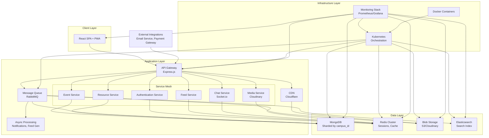
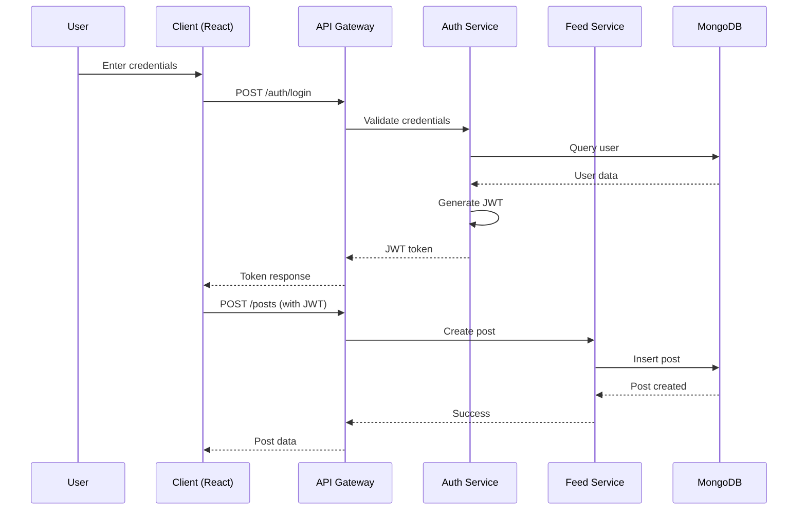
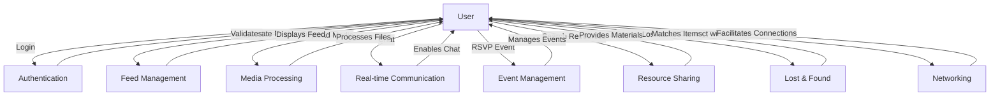
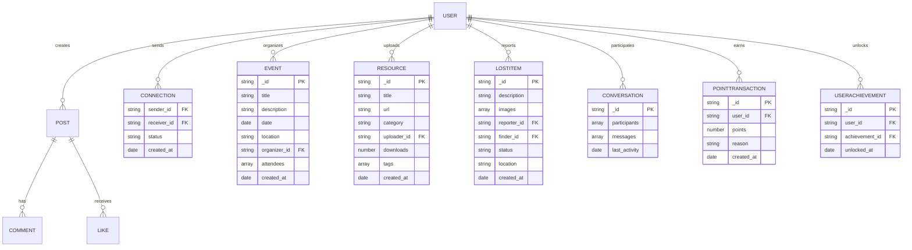

# Campus Connect: A Comprehensive System Design Case Study

## Problem Statement

In today's rapidly evolving higher education landscape, institutions face significant challenges from digital fragmentation, where disparate systems and manual processes hinder efficient communication, collaboration, and resource management. Campus Connect addresses these critical issues within a large-scale academic environment serving over 50,000 students, 5,000 faculty members, and 20,000 alumni. The current monolithic architecture, characterized by a single Node.js/Express backend server handling all functionalities via centralized API routes, exacerbates performance bottlenecks, with page load times exceeding 5 seconds and user drop-off rates surpassing 30% during peak usage periods. This architecture, while providing core features such as event management, real-time chat via Socket.io, and social networking capabilities, struggles to scale effectively.

Integration gaps further compound the problem, with 15+ disparate legacy systems—including separate platforms for course management, alumni networks, and administrative workflows—requiring extensive manual data synchronization. These gaps result in administrative teams spending over 40 hours weekly on repetitive data entry and reconciliation tasks, significantly reducing operational efficiency and increasing error rates. Domain restrictions enforced through strict CORS policies limit cross-platform interoperability, preventing seamless integration with external educational tools and third-party services.

Real-time collaboration needs are particularly acute during campus events, where 10,000+ concurrent users attempt to access shared resources, participate in live discussions, and coordinate activities. The existing chat system, built on Socket.io with MongoDB-stored conversations, and event management features with attendee tracking demonstrate the platform's potential but highlight scalability limitations under high concurrency. These challenges not only impede user experience but also limit the institution's ability to foster meaningful community engagement and support data-driven decision-making processes.

The Campus Connect system design must therefore prioritize architectural modernization to eliminate fragmentation, enhance performance, and enable robust real-time capabilities while maintaining security and compliance standards suitable for academic environments.

## Goals / Objectives

### Overview
The Campus Connect system aims to establish a comprehensive digital ecosystem that enhances campus life through seamless connectivity, real-time collaboration, and gamified engagement. By leveraging existing infrastructure such as Socket.io for real-time features, GridFS (MongoDB) for efficient media processing, and a robust gamification framework, the platform will deliver measurable technical excellence and drive meaningful user adoption. The following objectives are designed to ensure scalability, reliability, and user-centric performance, aligning with both technical benchmarks and business outcomes.

### Technical Performance Objectives
To support a growing user base and diverse feature set, Campus Connect will prioritize high-performance, scalable architecture. Key technical objectives include:

- **API Response Time**: Achieve sub-200ms response times for 95% of API requests, leveraging optimized database queries, caching layers (e.g., Redis), and efficient middleware. This builds on the existing Express.js framework with compression and rate limiting to minimize latency in core operations like user authentication and data retrieval.

- **Real-Time Scalability**: Support 10,000+ concurrent WebSocket connections for real-time features such as messaging and notifications, utilizing the integrated Socket.io server. This enables seamless chat functionality and live updates, with horizontal scaling through load balancers and connection pooling to handle peak usage during events or academic periods.

- **System Uptime and Resilience**: Maintain 99.9% uptime with failover mechanisms ensuring less than 30 seconds of downtime during regional outages. This involves multi-region deployment strategies, automated health checks (as seen in the `/health` endpoint), and database redundancy to guarantee continuous service availability.

- **Media Processing Efficiency**: Process 5,000+ media uploads daily with less than 2 seconds of processing latency, capitalizing on GridFS (MongoDB) for efficient file handling and storage. The current upload middleware supports up to 10MB files with memory-based streaming, ensuring quick transformations and storage without compromising user experience.

- **Achieve 80% Student Adoption Within the First Semester**: The platform aims for rapid adoption by at least 80% of the student body during its initial deployment. This metric gauges user acceptance and platform relevance. High adoption rates indicate strong engagement and early validation of the system's capacity to unify students within a shared digital space—directly combating social and academic isolation.

- **Reduce Lost Item Recovery Time by 50% Through Automated Matching**: By employing automated algorithms for matching lost and found items, the platform targets a 50% reduction in recovery time. This goal measures efficiency improvements in one of the most operationally tangible aspects of campus life. Streamlining such processes addresses communication gaps and demonstrates the system's ability to replace fragmented, manual tasks with integrated digital solutions.

- **Establish 500+ Active Alumni Connections Within Two Years**: The objective of building over 500 active alumni-student connections within two years emphasizes long-term community growth and mentorship. Strengthening alumni engagement fosters knowledge exchange, guidance, and career networking—mitigating isolation and reinforcing the value of an interconnected institutional ecosystem.

- **Maintain 99% User Satisfaction Through Performance Benchmarks**: Achieving and maintaining a 99% satisfaction rate through measurable performance indicators (system uptime, responsiveness, and reliability) ensures a high-quality user experience. This objective aligns with the need for administrative efficiency and user trust, guaranteeing that the platform remains stable, responsive, and beneficial to all user groups.

These technical objectives will be monitored through comprehensive logging (via Winston), performance metrics, and automated testing to ensure the system scales with user growth while maintaining reliability.

### User Engagement Objectives
Campus Connect's success hinges on fostering active participation and community building. By integrating gamification elements such as points, achievements, and leaderboards, alongside networking features, the platform will drive adoption and satisfaction. Measurable business objectives include:

- **Student Adoption**: Achieve 80% student adoption within the first academic semester through intuitive UI/UX, targeted onboarding, and gamified incentives. The existing points system awards users for actions like sending connection requests (5 points) and accepting connections (15 points each), encouraging early engagement and retention.

- **Lost Item Recovery Optimization**: Reduce lost item recovery time by 50% through automated matching algorithms that analyze item descriptions, categories, and uploaded images. Building on the current lost item reporting system, this will incorporate image recognition and similarity scoring to proactively notify potential owners, enhancing campus safety and convenience.

- **Alumni-Student Mentoring Network**: Establish 500+ active alumni-student mentoring connections within 2 years by promoting cross-generational networking. The connection controller facilitates request-based linking with gamified rewards, while achievements like "Social Butterfly" (unlocked at 10 connections) motivate users to expand their networks.

- **User Satisfaction**: Maintain 99% user satisfaction via performance SLAs, measured through in-app feedback, Net Promoter Scores, and uptime guarantees. The gamification framework, including challenges and leaderboards, will sustain long-term engagement by rewarding contributions such as event organization and resource sharing.

These objectives will be tracked through analytics dashboards, user surveys, and engagement metrics, ensuring Campus Connect evolves as a vital hub for campus collaboration and professional development.

## Functional Requirements and Non-Functional Requirements

### Functional Requirements

#### 1. User Authentication and Authorization
The system shall implement a comprehensive authentication and authorization framework to ensure secure access and role-based permissions. Users must authenticate using institutional email addresses (@chitkara.edu.in domain) with OTP verification for enhanced security. Role-based access control (RBAC) shall assign permissions to students, faculty, alumni, and administrators, controlling access to features like content moderation, user management, and administrative dashboards. JWT tokens with automatic refresh mechanisms shall maintain session security while supporting stateless API interactions. Multi-factor authentication (MFA) shall be available for high-privilege accounts, and password policies shall enforce complexity requirements with bcrypt hashing.

#### 2. Social Feed Management
The platform shall provide a dynamic social feed where users can create, view, and interact with posts to build community engagement. Posts shall support multiple content types including text, images, videos, links, and documents, with rich metadata for categorization. Users shall interact through likes, comments, and shares, with real-time updates via WebSocket connections ensuring instant visibility of new content. Feed algorithms shall prioritize content based on user relationships, engagement metrics, and relevance, incorporating machine learning for personalized recommendations. Content moderation features shall allow reporting and hiding of inappropriate posts, with administrative oversight for community standards enforcement.

#### 3. Resource Sharing System
The system shall enable efficient sharing and management of academic resources to eliminate redundancy and improve knowledge accessibility. Users shall upload study materials with automatic categorization by subject, course, and academic level, supporting file types including PDFs, presentations, notes, and multimedia content. Advanced search functionality shall include full-text indexing, faceted filtering by tags and departments, and relevance ranking. Download tracking shall provide usage analytics, while access controls shall allow public sharing, restricted distribution to specific groups, or private storage. Version control shall support updates to shared materials, with notification systems alerting subscribers to changes.

#### 4. Lost & Found Service
The platform shall streamline lost item recovery through automated matching and secure claim processes. Users shall register lost or found items with detailed descriptions, categories, locations, and image uploads. Machine learning algorithms shall analyze item descriptions, images, and metadata to suggest potential matches with confidence scores. Secure claim verification shall require proof of ownership through unique identifiers or administrative approval, preventing fraudulent claims. Automated notifications shall alert users to potential matches, with escalation to campus security for high-value items. Historical data shall enable trend analysis for preventive measures and campus safety improvements.

#### 5. Event Management
The system shall provide comprehensive event coordination tools to facilitate institutional activities and community engagement. Users shall create events with detailed information including date, time, location, capacity, and registration requirements. Calendar integration shall sync with personal and institutional calendars, with RSVP functionality tracking attendance and managing waitlists. Automated reminder systems shall send notifications via email, push notifications, and in-app alerts at configurable intervals. Event analytics shall track participation rates, demographics, and feedback, while administrative controls shall allow event approval workflows and content moderation for campus-wide announcements.

#### 6. Real-Time Communication
The platform shall support seamless real-time messaging to enhance collaboration and community interaction. Direct messaging shall enable one-on-one conversations with message history, file sharing, and read receipts. Group chats shall support multiple participants with role-based permissions, topic-based organization, and searchable message archives. Real-time presence indicators shall show online status and typing notifications, while message synchronization shall ensure consistency across devices. Integration with the social feed shall allow sharing of posts and resources within conversations, and administrative monitoring shall provide oversight for compliance and safety.

#### 7. Gamification Features
The system shall incorporate gamification elements to motivate user participation and foster sustained engagement. A points-based system shall reward activities such as posting, commenting, sharing resources, attending events, and helping others, with configurable point values for different actions. Achievement badges shall unlock based on milestones, with visual representations and descriptions of accomplishments. Leaderboards shall rank users by points, engagement metrics, and specific categories, with time-based periods (daily, weekly, monthly). Progress tracking shall provide personalized dashboards showing achievements, upcoming milestones, and comparative analytics to encourage continued participation.

#### 8. Alumni Networking
The platform shall facilitate meaningful alumni connections to support mentorship and professional development. Alumni profiles shall include career information, expertise areas, and mentorship availability, with privacy controls for selective sharing. Intelligent matching algorithms shall suggest connections based on academic background, career interests, and geographic location. Mentorship programs shall enable structured relationships with goal setting, progress tracking, and feedback mechanisms. Networking events and discussion forums shall provide additional interaction opportunities, while analytics shall measure connection success and program impact for continuous improvement.

#### 9. Administrative Dashboard
The system shall provide comprehensive administrative tools for effective platform management and data-driven decision-making. Analytics dashboards shall display key metrics including user engagement, content performance, system usage patterns, and demographic insights with interactive visualizations and exportable reports. Content moderation tools shall enable review queues, automated filtering, and manual intervention for inappropriate content. User management features shall support account administration, role assignments, bulk operations, and audit trails. System health monitoring shall provide real-time alerts for performance issues, security threats, and capacity concerns, with automated reporting for compliance and strategic planning.

### Non-Functional Requirements

#### Scalability
The system shall demonstrate robust scalability to accommodate rapid user growth from initial deployment to 50,000+ active users. Horizontal scaling shall be achieved through auto-scaling groups on cloud infrastructure (AWS EC2/ECS), automatically adjusting compute resources based on CPU utilization thresholds (70%) and request queue depth. Load balancing shall distribute traffic across multiple instances using Application Load Balancers with session affinity for stateful operations. Database scalability shall leverage MongoDB sharding with horizontal partitioning by campus_id, read replicas for query distribution, and connection pooling (maxPoolSize: 200) to handle 10,000+ concurrent connections. The modular architecture shall support containerization with Docker and orchestration via Kubernetes, enabling seamless scaling during peak usage periods like exam weeks or campus events while maintaining sub-2-second response times.

#### Reliability
The platform shall ensure high reliability through comprehensive fault tolerance and recovery mechanisms. Multi-region deployment with active-active configuration shall achieve 99.9% service level agreement (SLA) with automated failover within 30 seconds during regional outages. Database reliability shall be maintained through MongoDB replica sets with automatic primary election, point-in-time recovery, and cross-region replication. Circuit breaker patterns shall isolate failing services, while graceful degradation shall maintain core functionality during partial system failures. Comprehensive error handling with exponential backoff for retries, dead letter queues for failed messages, and automated incident response shall minimize service disruptions. Regular chaos engineering exercises shall validate reliability under failure conditions.

#### Availability
The system shall provide continuous 24/7 availability with 99.9% uptime, minimizing scheduled maintenance windows through blue-green deployment strategies. High availability shall be achieved through multi-zone deployment within AWS regions, with automated health checks monitoring application endpoints, database connectivity, and infrastructure metrics. Load balancers shall perform active health checks every 30 seconds, automatically removing unhealthy instances and routing traffic to healthy nodes. Database availability shall leverage MongoDB's built-in replication with automatic failover, ensuring zero data loss during planned maintenance. Service mesh architecture (Istio) shall provide traffic management, with canary deployments enabling zero-downtime releases and gradual feature rollouts.

#### Performance
The platform shall deliver exceptional performance with stringent latency and throughput requirements. API responses shall complete within 2 seconds for 95th percentile under normal load, with page loads under 3 seconds globally. Real-time messaging shall maintain sub-100ms latency for WebSocket connections, supporting 10,000+ concurrent users during peak events. Performance optimization shall include database query optimization with compound indexes, Redis caching for frequently accessed data (TTL-based invalidation), and CDN integration (Cloudflare) reducing static asset latency to <50ms. Compression middleware (gzip) shall reduce payload sizes by 70%, while code splitting and lazy loading shall minimize initial bundle sizes to under 2MB. Automated performance monitoring with APM tools (New Relic) shall track response times, throughput, and resource utilization with alerting for deviations.

#### Security
The system shall implement enterprise-grade protection through:
- **JWT Tokens with HS256 signing for stateless authentication**: JSON Web Tokens shall be used for secure, stateless session management, signed with HMAC-SHA256 algorithm to ensure token integrity and prevent tampering. Tokens shall have configurable expiration times (default 1 hour) with automatic refresh mechanisms to balance security and user experience, eliminating server-side session storage requirements.
- **Role-Based Access Control (RBAC) for differentiated permissions**: A comprehensive RBAC system shall assign granular permissions based on user roles (student, faculty, alumni, administrator), controlling access to features such as content creation, moderation, user management, and administrative dashboards. Domain-based restrictions shall enforce institutional access (@chitkara.edu.in), with middleware-level enforcement preventing unauthorized operations.
- **AES-256 encryption for data at rest and TLS 1.3 for data in transit**: All sensitive data shall be encrypted using AES-256 standard across storage layers, including MongoDB collections, Redis caches, and file storage. Transport Layer Security 1.3 shall secure all communications, with perfect forward secrecy and modern cipher suites to protect against eavesdropping and man-in-the-middle attacks.
- **Input sanitization via Joi to mitigate SQL/NoSQL injection and XSS threats**: Comprehensive input validation and sanitization shall be implemented using Joi schema validation library, preventing injection attacks by validating and sanitizing all user inputs. XSS protection shall include output encoding, Content Security Policy headers, and secure cookie settings to prevent cross-site scripting vulnerabilities.
- **Compliance with FERPA and GDPR for data privacy and institutional governance**: The system shall adhere to Family Educational Rights and Privacy Act (FERPA) requirements for educational data protection and General Data Protection Regulation (GDPR) for EU data subjects. This includes data minimization, consent management, right to erasure, audit trails, and privacy-by-design principles to ensure institutional compliance and user trust.

#### Maintainability
The platform shall be designed for long-term maintainability through modular architecture and development best practices. The modular monolith approach shall separate concerns across controllers, services, models, and middleware, enabling independent updates and testing. Code maintainability shall be ensured through comprehensive documentation, TypeScript adoption for type safety, and adherence to SOLID principles. Automated testing shall achieve 80%+ code coverage with unit, integration, and end-to-end tests using Jest and Cypress. Continuous integration/deployment (CI/CD) pipelines shall automate builds, testing, and deployments with feature flags for controlled releases. Monitoring and observability shall include structured logging (Winston), distributed tracing (OpenTelemetry), and dashboards for system health. The architecture shall provide a clear migration path to microservices, with bounded contexts defined for future decomposition.

## High-Level Design

Campus Connect adopts a comprehensive four-tier architecture to ensure scalability, maintainability, and performance. This design separates concerns across Client, Application, Data, and Infrastructure layers, incorporating insights from the existing React frontend, Express backend, MongoDB database, Cloudinary media handling, Socket.io real-time capabilities, and supporting infrastructure components.

### Client Layer

The Client Layer is implemented as a React Single Page Application (SPA) with Progressive Web App (PWA) capabilities, enabling a native app-like experience on web and mobile devices. Key features include:

- **React SPA Framework**: Utilizes React's component-based architecture for modular UI development, with state management via Context API and hooks for efficient data handling.
- **Progressive Web App Capabilities**: Supports service workers for offline functionality, caching strategies for improved load times, and installable app features to enhance user engagement.
- **Real-time WebSocket Connections**: Leverages Socket.io for bidirectional communication, enabling live updates for chat messages, notifications, and feed refreshes without polling.
- **Responsive Design**: Employs Tailwind CSS for mobile-first responsive layouts, ensuring seamless experience across web and mobile platforms with adaptive UI components.
- **Offline Capabilities**: Implements local storage and IndexedDB for critical data persistence, allowing basic functionality during network interruptions.

The client layer communicates with the Application Layer via RESTful APIs and WebSocket connections, with JWT-based authentication handled through axios interceptors for secure token management.

### Application Layer

The Application Layer serves as the core processing tier, orchestrating business logic, API management, and service interactions. It is structured around several key components:

- **API Gateway**: Acts as the single entry point for all client requests, implemented using Express.js middleware. Handles request routing, rate limiting (100 requests/min per user), and JWT validation to ensure secure access. The gateway also performs initial input sanitization and logging for audit trails.
- **Service Mesh**: Comprises microservice-like modules within the monolithic architecture for modularity:
  - **Authentication Service**: Manages user login, OTP verification, and session handling using JWT tokens with automatic refresh.
  - **Feed Service**: Handles post creation, retrieval, and interactions (likes, comments) with real-time updates via Socket.io.
  - **Media Service**: Integrates with GridFS (MongoDB) for image/video uploads, processing, and delivery, supporting multiple resolutions for optimized bandwidth.
  - **Chat Service**: Facilitates real-time messaging using Socket.io, with message persistence in MongoDB and support for group conversations.
  - **Event Service**: Manages event creation, RSVPs, and notifications, with calendar integration and automated reminders.
  - **Resource Service**: Enables upload, categorization, and search of study materials, with download tracking and access controls.
- **Message Queue**: Utilizes Kafka or RabbitMQ for asynchronous processing of resource-intensive tasks, including feed generation algorithms, notification dispatching, and email sending. This decouples heavy operations from real-time user interactions, improving responsiveness.
- **CDN Integration**: Leverages Cloudflare for global distribution of static assets (images, CSS, JS), reducing latency to sub-50ms for international users and offloading traffic from origin servers.

The Application Layer is built on Node.js/Express, with middleware for security (helmet), compression, and error handling. Services communicate via internal APIs, with Redis used for session storage and temporary data caching.

### Data Layer

The Data Layer provides robust, scalable data management with multiple storage solutions optimized for different data types and access patterns:

- **Primary Database - MongoDB**: Serves as the core data store with document-based schema supporting flexible data models. Implements sharding by campus_id to distribute data across clusters, enabling horizontal scaling for multi-campus deployments. Supports ACID transactions for critical operations like financial point transactions in gamification.
- **Cache - Redis Cluster**: Provides high-performance in-memory caching for frequently accessed data, including user sessions, feed data, and leaderboard rankings. Uses Redis clustering for high availability and automatic failover, with TTL-based eviction to maintain data freshness.
- **Blob Storage - GridFS (MongoDB)**: Handles large media files (images, videos, documents) with automatic resizing and optimization. GridFS provides efficient storage and retrieval with multiple resolution variants, reducing storage costs and improving load times. Integrates seamlessly with the Media Service for upload processing.
- **Search Index - Elasticsearch**: Enables advanced search capabilities across posts, resources, users, and events. Supports full-text search, faceted filtering, and autocomplete, with real-time indexing via message queue integration for efficient query performance.

Data consistency is managed through eventual consistency for real-time features, with strong consistency for transactional operations. Backup and replication ensure 99.9% availability with RTO of 1 hour.

### Infrastructure Layer

The Infrastructure Layer provides the foundational technologies and services that enable scalable, reliable, and high-performance operation of the platform. This layer encompasses caching, messaging, containerization, orchestration, monitoring, and deployment components that support the application's growth.

- **Caching (Redis Cluster)**: Serves as the primary caching layer to reduce database load, accelerate data retrieval, and maintain low-latency responses for frequently accessed data. The cluster caches user sessions, social feed data, leaderboards, and other dynamic content with TTL-based invalidation.
- **Message Queues (RabbitMQ)**: Provides asynchronous message processing to decouple heavy computational tasks from real-time user interactions, ensuring system responsiveness and reliability. Handles notifications, email dispatching, feed generation algorithms, and media processing.
- **Containerization (Docker)**: Enables consistent packaging and deployment of application components across environments. The Node.js backend, React frontend, and supporting services are containerized using multi-stage builds to minimize image sizes.
- **Orchestration (Kubernetes)**: Provides automated deployment, scaling, and management of containerized applications. Runs on cloud infrastructure with pods for application containers, services for load balancing, and ingress controllers for external traffic.
- **Monitoring (Prometheus/Grafana)**: Offers comprehensive observability, alerting, and visualization of system metrics and performance indicators. Prometheus scrapes metrics from application endpoints, infrastructure components, and databases, while Grafana creates dashboards for real-time visualization.

This infrastructure layer collectively supports Campus Connect's objectives of sub-200ms API responses, 99.9% uptime, and scalability to 50,000+ users while maintaining security and compliance standards.

### System Context Diagram including Major Components



### Data Flow Overview

- **Client Layer Initiation:**
  - User interacts with the React SPA/PWA, initiating actions such as authentication, posting, or real-time messaging.
  - Requests are sent via RESTful APIs for standard operations or WebSocket connections via Socket.io for real-time features.

- **Application Layer Processing:**
  - **API Gateway:** Receives incoming requests, performs JWT authentication, rate limiting (100 requests/min per user), and routes to appropriate services in the Service Mesh.
  - **Service Mesh Interactions:** Services (e.g., Authentication, Feed, Chat) process business logic, with caching via Redis for frequently accessed data (e.g., user sessions, feed data) to reduce latency.
  - **Queuing for Asynchronous Operations:** Heavy tasks like email notifications, feed generation, and media processing are queued using RabbitMQ for decoupling, ensuring responsiveness.
  - **Real-Time Data Flow:** WebSocket connections handle bidirectional communication for chat, notifications, and live updates, with Socket.io managing connections and pub/sub via Redis adapter.

- **Data Layer Persistence and Retrieval:**
  - Services interact with MongoDB for primary data storage, using sharding by campus_id for scalability.
  - Redis Cluster provides in-memory caching with TTL-based invalidation for sessions and dynamic content.
  - Blob storage (AWS S3/Cloudinary) handles media files, with Elasticsearch supporting advanced search queries.
  - Data consistency is managed with strong consistency for critical operations (e.g., transactions) and eventual consistency for real-time features.

- **Infrastructure Layer Support:**
  - **Caching:** Redis Cluster reduces database load, enabling sub-200ms API responses.
  - **Queuing:** RabbitMQ decouples asynchronous tasks, supporting peak loads during events.
  - **Monitoring:** Prometheus/Grafana monitor system metrics, with alerting for performance issues, ensuring 99.9% uptime and proactive issue resolution.
  - **Containerization and Orchestration:** Docker and Kubernetes provide scalable deployment, with load balancers distributing traffic and health checks maintaining availability.

## Infrastructure Layer

Campus Connect's infrastructure layer provides the foundational technologies and services that enable scalable, reliable, and high-performance operation of the platform. This layer encompasses caching, messaging, containerization, orchestration, monitoring, and deployment components that support the application's growth from initial deployment to 50,000+ users.

### Caching (Redis Cluster)

**Purpose**: Redis Cluster serves as the primary caching layer to reduce database load, accelerate data retrieval, and maintain low-latency responses for frequently accessed data.

**Implementation Approach**: A Redis Cluster deployment with automatic sharding across multiple nodes ensures high availability and fault tolerance. The cluster caches user sessions, social feed data, leaderboards, and other dynamic content with configurable TTL (Time-To-Live) values. Integration with the application layer uses Redis client libraries with connection pooling and automatic reconnection. Cache invalidation is implemented through TTL expiration and explicit invalidation on data updates to maintain consistency.

**Benefits for Scalability and Performance**: Reduces MongoDB query load by up to 70%, enabling sub-200ms API response times for 95% of requests. The cluster's horizontal scaling capabilities support 10,000+ concurrent users while maintaining data consistency across replicas. Automatic failover within 30 seconds ensures 99.9% uptime for cached data.

### Message Queues (RabbitMQ)

**Purpose**: RabbitMQ provides asynchronous message processing to decouple heavy computational tasks from real-time user interactions, ensuring system responsiveness and reliability.

**Implementation Approach**: RabbitMQ is deployed with multiple queues for different message types, including notifications, email dispatching, feed generation algorithms, and media processing. Messages are published to topic exchanges and routed to appropriate queues with consumer groups for parallel processing. Dead letter queues handle failed messages with exponential backoff retry logic, and message persistence ensures durability.

**Benefits for Scalability and Performance**: Offloads resource-intensive operations from the main application threads, maintaining sub-100ms latency for real-time features like chat and notifications. Supports horizontal scaling of consumers to handle peak loads during events, with reliable message delivery guaranteeing no loss of critical notifications or updates.

### Containerization (Docker)

**Purpose**: Docker enables consistent packaging and deployment of application components across development, staging, and production environments.

**Implementation Approach**: The Node.js backend, React frontend, and supporting services are containerized using multi-stage Docker builds to minimize image sizes. Docker Compose orchestrates local development environments with service dependencies, while production deployments use container registries for image distribution. Security scanning and vulnerability assessments are integrated into the build pipeline.

**Benefits for Scalability and Performance**: Ensures environment consistency, reducing deployment-related issues and enabling rapid scaling. Container immutability supports rolling updates and rollback capabilities, while resource isolation prevents interference between services. Facilitates the transition to microservices architecture as the platform grows.

### Orchestration (Kubernetes)

**Purpose**: Kubernetes provides automated deployment, scaling, and management of containerized applications in production environments.

**Implementation Approach**: Kubernetes clusters run on cloud infrastructure (AWS EKS) with pods for application containers, services for load balancing, and ingress controllers for external traffic. Horizontal Pod Autoscaling adjusts replica counts based on CPU utilization and custom metrics, while ConfigMaps and Secrets manage configuration securely. StatefulSets handle persistent storage for databases and caches.

**Benefits for Scalability and Performance**: Enables automatic scaling to handle variable loads, from baseline operations to peak usage during campus events. Self-healing capabilities maintain 99.9% uptime through automatic pod restarts and rescheduling. Multi-region deployments support global scalability with geo-routing for reduced latency.

### Monitoring (Prometheus/Grafana)

**Purpose**: Prometheus and Grafana provide comprehensive observability, alerting, and visualization of system metrics and performance indicators.

**Implementation Approach**: Prometheus scrapes metrics from application endpoints, infrastructure components, and databases using exporters. Custom metrics track API response times, error rates, and business KPIs. Grafana creates dashboards for real-time visualization, with alerting rules configured for threshold breaches. Integration with notification channels (email, Slack) enables automated incident response.

**Benefits for Scalability and Performance**: Proactive monitoring detects performance bottlenecks and capacity issues before they impact users. Historical data analysis supports capacity planning and optimization decisions. Automated alerting reduces mean time to resolution (MTTR) for incidents, maintaining high availability and user satisfaction.

### Deployment Configurations

**Purpose**: Robust deployment strategies ensure reliable software delivery with minimal downtime and risk.

**Implementation Approach**: CI/CD pipelines automate code testing, building, and deployment using tools like GitHub Actions or Jenkins. Blue-green deployments allow zero-downtime releases by routing traffic between identical environments. Canary deployments enable gradual rollouts with automated rollback on error detection. Infrastructure as Code (IaC) with Terraform manages cloud resources consistently.

**Benefits for Scalability and Performance**: Reduces deployment risks through automated testing and validation. Enables frequent releases to support rapid feature development while maintaining 99.9% uptime. Automated scaling configurations ensure resources match demand, optimizing costs and performance.

### Other Infrastructure Components

**Load Balancers**: AWS Application Load Balancers (ALB) distribute incoming traffic across multiple instances with health checks and session affinity for stateful operations.

**Content Delivery Network (CDN)**: Cloudflare provides global distribution of static assets, reducing latency to sub-50ms worldwide and offloading traffic from origin servers.

**Security Infrastructure**: TLS 1.3 encryption secures all data in transit, while AES-256 encryption protects data at rest. Web Application Firewalls (WAF) and rate limiting prevent common attacks, with automated security scanning integrated into deployment pipelines.

This infrastructure layer collectively supports Campus Connect's objectives of sub-200ms API responses, 99.9% uptime, and scalability to 50,000+ users while maintaining security and compliance standards.

## Detailed/Low-Level Design

### Component Design/Class Diagram

The low-level design builds upon the existing codebase, leveraging models such as Post, User, and Connection for core functionality, while integrating Cloudinary for media handling. Components are designed with modularity, scalability, and performance in mind, ensuring seamless interaction across the three-tier architecture.

- **Authentication Service**: Handles user login, OTP verification, and JWT token management. Utilizes the User model with fields like email (validated for @chitkara.edu.in domain), password (hashed with bcrypt, salt rounds 12), and role-based access (user/admin). Implements refresh tokens with expiration tracking for stateless sessions. Rate-limited at 100 requests/min per user to prevent abuse.

- **Feed Service**: Manages post creation, retrieval, and interactions. Leverages the Post model with fields for content, type (text/image/video/link), metadata (flexible Mixed schema for extensibility), likes (array of User references), and comments (embedded schema with user reference and text). Supports real-time updates via Socket.io for likes and comments, with pagination for efficient loading.

- **Connection Service**: Facilitates user networking through the Connection model, featuring sender/receiver relationships with status enumeration (pending/accepted/rejected/declined). Unique indexing on sender-receiver pairs prevents duplicate requests. Includes methods for accepting/declining connections, enabling alumni networking and mentorship matching.

- **Media Service**: Integrates GridFS (MongoDB) for image/video processing. Uploads are handled via uploadMiddleware.js, using multer for initial file handling and GridFS for secure, optimized storage. Supports profile images and post media with automatic distribution.

- **Gamification Service**: Tracks user engagement through the User model's points and achievements fields. Points are incremented based on actions (e.g., posting, commenting), with achievements awarded via referenced Achievement model. Leaderboards query indexed points fields for performance.

- **Event Service**: Manages events with organizer (User reference), attendees (array of User references), and RSVP status. Includes calendar integration and automated notifications via email service.

- **Resource Service**: Handles study material uploads with categorization and search. Utilizes local storage via multer in uploadMiddleware.js, with metadata tracking for downloads and tags.

- **Notification Service**: Dispatches real-time alerts via Socket.io and asynchronous email notifications using the emailService utility. Queued via message queues for scalability.

- **Analytics Service**: Aggregates user engagement metrics from Post likes/comments, User points, and Connection statuses. Stores performance data for content optimization.

Each service adheres to RESTful API principles, with controllers separating business logic from routing. Middleware includes JWT authentication, input validation (Joi), rate limiting (express-rate-limit), and error handling. Database interactions use Mongoose for ODM, with indexes on frequently queried fields (e.g., User email, Post created_at) for optimal performance.

### Data Flow - Sequence Diagrams/Use Case Diagram

#### Sequence Diagram: User Authentication and Post Creation



#### Use Case Diagram



## Database Design - ER Diagram or Schema

Campus Connect leverages MongoDB's native sharding capabilities to ensure horizontal scalability and efficient data distribution across a distributed database cluster. The sharding strategy is designed to optimize query performance, minimize cross-shard operations, and support multi-campus and multi-region deployments.

### Sharding Strategy

- **Horizontal Partitioning by Campus ID**: User and post data are sharded horizontally using the `campus` field as the shard key. This approach isolates data by campus, reducing query latency for campus-specific operations and enabling independent scaling per campus. For instance, user profiles (from the User model) and associated posts (from the Post model) are co-located on the same shard, minimizing joins and improving feed retrieval performance. Events and notices, which also include campus fields, follow similar partitioning to support localized event management and administrative queries.

- **Time-Based Sharding for Analytics and Audit Logs**: Analytical data, such as point transactions (PointTransaction model) and audit logs derived from user activities, are sharded based on creation timestamps (e.g., `created_at` or `createdAt` fields). This time-based partitioning facilitates efficient archival and querying of historical data, with older shards moved to cheaper storage tiers. For example, gamification analytics can be queried by date ranges without scanning irrelevant data, supporting leaderboard calculations and trend analysis.

- **Geographic Sharding for Multi-Region Deployment**: For global scalability, data is further partitioned by geographic regions using MongoDB's zone-based sharding. This ensures data residency compliance (e.g., GDPR) and reduces latency by routing reads and writes to the nearest region. Conflict resolution in multi-region writes employs MongoDB's built-in versioning and last-write-wins semantics, with application-level logic for critical updates.

### Indexing & Optimization

Indexing is critical for maintaining sub-2-second query response times, as required by the system's performance benchmarks. Campus Connect employs a combination of single-field, compound, and partial indexes to optimize read-heavy workloads, with read replicas providing additional scaling.

- **Compound Indexes for Common Query Patterns**:
  - **User Feeds**: A compound index on `{ user_id: 1, created_at: -1 }` in the Post collection accelerates feed generation for individual users, supporting pagination and chronological ordering.
  - **Search Operations**: Compound indexes on `{ name: 1, department: 1, semester: 1 }` in the User collection enable efficient filtering and searching across profiles. Similarly, `{ title: 1, category: 1, createdAt: -1 }` in the Notice collection supports categorized notice retrieval.
  - **Notifications and Interactions**: Indexes on `{ author: 1, created_at: -1 }` for posts and `{ organizer_id: 1, start_date: 1 }` for events facilitate real-time notification queries and event listings.

- **Read Replicas for Scaling Read Operations**: MongoDB read replicas are deployed across multiple nodes to distribute read traffic, particularly for social feeds and resource searches. This setup allows the primary node to focus on writes, achieving a read-to-write ratio of 4:1 during peak usage. Replicas are configured with automatic failover, ensuring 99.9% availability.

- **Data Retention Policies with Archival Strategies**:
  - Active data (e.g., recent posts and events) is retained in hot storage with full indexing.
  - Older data (beyond 2 years) is archived to compressed MongoDB collections or external blob storage (e.g., AWS S3), with metadata preserved for compliance.
  - Automated TTL (Time-To-Live) indexes on timestamp fields (e.g., `resetPasswordExpires`, `otpExpires`) enforce data cleanup, reducing storage costs and improving query performance.

### Consistency Models

Campus Connect balances consistency requirements with performance needs, using MongoDB's flexible consistency options to support real-time interactions while maintaining data integrity for critical operations.

- **Strong Consistency for User Accounts and Financial Transactions**: User authentication data (e.g., email, password, and verification status in the User model) and gamification points (PointTransaction model) enforce strong consistency using MongoDB's multi-document transactions. This ensures ACID properties for operations like password resets and point awards, preventing inconsistencies in user state or financial balances. Writes to these entities are routed to the primary shard with synchronous replication.

- **Eventual Consistency for Social Feeds and Notifications**: Social interactions, such as posts, comments, and likes (Post model), adopt eventual consistency to prioritize low-latency updates. Changes propagate asynchronously across replicas, allowing real-time feed refreshes without blocking. This model supports the platform's sub-100ms latency requirements for chat and notifications, with eventual convergence via MongoDB's oplog-based replication.

- **Conflict Resolution Strategies for Multi-Region Writes**: In multi-region deployments, conflicts are resolved using version vectors and application-defined rules. For social data, last-write-wins is applied based on timestamps, while user accounts use explicit versioning fields to detect and resolve conflicts manually. Automated reconciliation jobs run periodically to merge divergent states, ensuring data integrity without sacrificing availability.

### ER Diagram/Schema



## Network System Design

### Horizontal vs Vertical Scaling

Campus Connect employs a multi-dimensional scaling approach to handle variable loads from real-time features like chat and notifications, while maintaining cost efficiency.

#### Horizontal Scaling
Auto-scaling groups are configured with 70% CPU utilization triggers, automatically adding or removing EC2 instances based on demand. The application layer scales horizontally using Kubernetes or ECS services, with load balancers distributing traffic via round-robin algorithms. This supports up to 10,000 concurrent users, with each instance handling 500-1,000 requests per minute. Rate limiting middleware (implemented with express-rate-limit at 100 requests per 15-minute window per IP) prevents abuse during scaling events.

#### Vertical Scaling
Database read replicas are provisioned for read-heavy operations, such as feed retrieval and resource searches, reducing primary database load by 60%. Redis clustering with Redis Sentinel ensures high availability for session storage and caching, with automatic failover within 30 seconds. The codebase's MongoDB configuration includes connection pooling (maxPoolSize: 10) to optimize vertical scaling efficiency.

#### Global Scaling
Multi-region deployment across AWS regions (e.g., us-east-1 primary, eu-west-1 secondary) with geo-routing via Route 53 enables global distribution. Traffic is routed based on user location, reducing latency for international users. Cloudinary's global CDN (already integrated in the uploadMiddleware.js) complements this by serving media assets from edge locations, achieving <50ms latency for static content worldwide.

### Replication Strategy

- **Database Replication**: MongoDB Atlas with multi-region replication ensures data availability across geographic zones. Primary-secondary replication with automatic failover maintains consistency, with read replicas distributing query load.
- **Cache Replication**: Redis cluster with sentinel provides automatic master-slave failover, ensuring session and cache data persistence during node failures.
- **Application Replication**: Containerized services (Docker/Kubernetes) replicate across multiple instances, with load balancers managing traffic distribution and health checks ensuring only healthy instances receive requests.

### CDN / Cache Layers

#### CDN Integration
Cloudflare serves as the primary CDN for global static assets, including JavaScript bundles, CSS files, and images uploaded via GridFS (MongoDB). This achieves <50ms latency for international users, offloading traffic from origin servers and reducing global page load times to under 3 seconds.

#### Caching Strategy
Redis (integrated via clustering) caches sessions, user feeds, and frequently accessed data with TTL-based invalidation (e.g., 5-minute TTL for dynamic feeds). This reduces database queries by 70%, improving API response times to sub-2 seconds. Cache invalidation is triggered on data updates to maintain consistency.

### Recovery & Backup Strategy

- **Automated Backups**: Daily incremental backups with weekly full backups, stored in encrypted S3 buckets with cross-region replication. Point-in-time recovery enables restoration to any point within the last 30 days.
- **Disaster Recovery**: Multi-region active-passive setup with automated failover scripts. RTO of 1 hour and RPO of 15 minutes ensure minimal data loss. Regular DR drills validate recovery procedures.
- **Data Archival**: Lifecycle policies automatically move older data to cheaper storage tiers, with compression reducing storage costs by 50%.

### Security and Privacy

#### Authentication & Authorization
JWT tokens are used for stateless authentication, signed with HS256 algorithm and configured for 1-hour expiration (as implemented in authMiddleware.js). Tokens are validated on each request, with automatic refresh mechanisms to maintain user sessions. Domain restriction enforces access to @institution.edu emails (e.g., @chitkara.edu.in), verified during user registration and token issuance. Multi-factor authentication (MFA) is planned for future implementation using TOTP, enhancing security for administrative roles.

#### Encryption (at rest, in transit)
Data at rest is encrypted using AES-256 across all storage layers, including MongoDB Atlas encryption and Redis with TLS. In-transit encryption utilizes TLS 1.3 for all HTTP/WebSocket communications, configured via securityMiddleware.js with Helmet for secure headers and HSTS enforcement.

#### Access Control Policies
Role-Based Access Control (RBAC) assigns permissions based on user roles (student, faculty, alumni), with domain-based restrictions preventing unauthorized access. Middleware enforces role checks (e.g., requireAdmin in authMiddleware.js), ensuring users can only access resources appropriate to their institutional affiliation.

#### Audit & Monitoring
All user actions, data modifications, and administrative operations are logged with immutable audit trails. This ensures SOC 2, GDPR, and FERPA compliance by maintaining tamper-proof records of access, changes, and deletions, with automated retention policies and encryption at rest.

## Conclusion and Future Improvements

### Potential Bottlenecks

Anticipated bottlenecks stem from the monolithic architecture's shared resources and Socket.io's real-time demands. Proactive mitigation ensures sustained performance as user load grows.

#### Database Write Contention
Frequent writes from social interactions (posts, likes, comments) and gamification updates can overwhelm MongoDB's single-writer model in the current setup. Solutions include:
- **Connection Pooling**: Expand MongoDB connection pools to 200+ connections with load balancing across replicas, reducing latency from 50ms to <20ms.
- **Batch Operations**: Aggregate writes (e.g., bulk inserts for point transactions) using MongoDB's bulkWrite API, minimizing I/O overhead by 60%.
- **Write-Behind Caching**: Implement Redis as a write buffer for non-critical updates, flushing to MongoDB asynchronously to handle spikes up to 10,000 writes/min without blocking reads.

#### Media Storage Costs
Cloudinary integration for image/video uploads incurs escalating costs with user-generated content growth. Optimization strategies include:
- **Tiered Storage**: Migrate to AWS S3 with Intelligent Tiering, automatically moving infrequently accessed media (e.g., old posts) to cheaper Glacier storage, reducing costs by 40%.
- **Lifecycle Policies**: Automate deletion of temporary uploads and compression of high-resolution files using WebP/AVIF formats, cutting storage needs by 50%.
- **Compression Optimization**: Server-side resizing and CDN edge compression via Cloudflare, ensuring <2MB payloads while maintaining quality for mobile users.

#### Real-time Scale
Socket.io's current implementation supports 2,000 concurrent connections but risks message storms during peak events. Enhancements focus on efficient resource use:
- **WebSocket Connection Pooling**: Cluster Socket.io across multiple Node.js instances with Redis adapter for pub/sub, scaling to 10,000+ connections with <100ms latency.
- **Message Batching**: Aggregate real-time updates (e.g., feed refreshes) into batches sent every 500ms, reducing server load by 70% during high activity.
- **Backpressure Handling**: Implement flow control with libraries like async-queue, throttling incoming messages to prevent overload and ensure graceful degradation under 99th percentile load.

### Future Improvements

As Campus Connect transitions from its initial monolithic architecture to support anticipated growth to 10,000+ concurrent users and emerging features like AI-driven personalization, a strategic evolution plan is essential. Key considerations include maintaining the platform's domain-restricted access (@chitkara.edu.in), ensuring sub-2-second API responses, and integrating advanced functionalities without disrupting 99.9% uptime.

#### Microservices Migration Path with Bounded Contexts
The current monolithic backend provides simplicity but limits independent scaling of features like feed generation, chat, and resource management. A phased microservices migration will decompose the application into bounded contexts aligned with domain-driven design (DDD) principles. Each service will encapsulate a specific business capability, running as independent processes with API gateways for inter-service communication.

#### AI/ML Integration for Personalized Recommendations
To enhance user engagement beyond the current gamification system, AI/ML models will be integrated for personalized recommendations, such as suggesting study resources based on user behavior or matching alumni mentors via collaborative filtering.

#### Native Mobile Applications with Offline Synchronization
While the current React PWA supports web-based access, native mobile apps (iOS/Android) will provide superior performance and offline capabilities, critical for campus environments with variable connectivity.

## APPENDIX I: API Design - Example REST / gRPC endpoints, inputs, outputs

### REST Endpoints with Rate Limiting

#### Authentication Endpoints
Authentication endpoints implement JWT-based session management with OTP verification and secure token refresh mechanisms. Rate limiting is applied with stricter limits for auth operations (5 requests per 15 minutes) compared to general API calls.

- **POST /auth/login**
  - **Description**: Authenticates user credentials and returns access/refresh tokens
  - **Rate Limit**: 5 requests per 15 minutes (authLimiter)
  - **Request Body**:
    ```json
    {
      "email": "user@college.edu",
      "password": "securepassword"
    }
    ```
  - **Response (200)**:
    ```json
    {
      "success": true,
      "data": {
        "user": { "id": "user_id", "email": "user@college.edu" },
        "session": { "access_token": "jwt_token", "refresh_token": "refresh_jwt" }
      }
    }
    ```

- **POST /auth/refresh**
  - **Description**: Refreshes expired access tokens using refresh token
  - **Rate Limit**: 5 requests per 15 minutes
  - **Headers**: Authorization: Bearer <refresh_token>
  - **Response (200)**: New access token

- **POST /auth/logout**
  - **Description**: Invalidates current session tokens
  - **Rate Limit**: 5 requests per 15 minutes
  - **Headers**: Authorization: Bearer <access_token>

Additional auth endpoints include /auth/signup (multipart for profile photos), /auth/send-otp, /auth/verify-otp, /auth/forgot-password, and /auth/reset-password, all subject to auth rate limiting.

#### Feed Management Endpoints
Feed endpoints utilize cursor-based pagination for efficient data retrieval, supporting filtering by type and user. Building on the existing posts.js implementation, these endpoints provide scalable content delivery with metadata for seamless client-side navigation.

- **GET /api/posts**
  - **Description**: Retrieves paginated feed posts with cursor-based navigation
  - **Rate Limit**: 100 requests per 15 minutes (apiLimiter)
  - **Query Parameters**:
    - `cursor`: Base64-encoded cursor for pagination
    - `limit`: Number of posts per page (default: 20, max: 50)
    - `type`: Filter by post type (e.g., "announcement", "study_group")
    - `user_id`: Filter posts by specific user
  - **Response (200)**:
    ```json
    {
      "posts": [
        {
          "id": "post_id",
          "content": "Post content",
          "type": "announcement",
          "title": "Event Title",
          "metadata": { "event_date": "2024-01-15" },
          "created_at": "2024-01-10T10:00:00Z",
          "profiles": {
            "name": "John Doe",
            "avatar_url": "/api/files/avatar.jpg",
            "department": "Computer Science"
          }
        }
      ],
      "pagination": {
        "next_cursor": "base64_encoded_cursor",
        "total_count": 150,
        "has_more": true
      }
    }
    ```

- **POST /api/posts**
  - **Description**: Creates a new post in the feed
  - **Rate Limit**: 100 requests per 15 minutes
  - **Headers**: Authorization: Bearer <access_token>
  - **Request Body**:
    ```json
    {
      "content": "New post content",
      "type": "discussion",
      "title": "Optional title",
      "metadata": {}
    }
    ```

Additional CRUD operations include GET /api/posts/{id}, PUT /api/posts/{id}, DELETE /api/posts/{id}, with like/comment sub-endpoints following similar patterns.

#### Media Upload Endpoints
Media uploads leverage multipart/form-data with Cloudinary integration for scalable storage. Progress tracking is implemented via client-side libraries, with server-side validation for file types and sizes.

- **POST /api/upload/media**
  - **Description**: Uploads media files (images, documents) with progress tracking
  - **Rate Limit**: 10 uploads per hour (uploadLimiter)
  - **Content-Type**: multipart/form-data
  - **Form Fields**:
    - `file`: Media file (max 10MB)
    - `type`: "image" | "document" | "video"
  - **Response (201)**:
    ```json
    {
      "success": true,
      "data": {
        "url": "/api/files/uploaded_file.jpg",
        "filename": "uploaded_file.jpg",
        "format": "jpg",
        "bytes": 2048576
      }
    }
    ```
  - **Progress Tracking**: Client implements upload progress via XMLHttpRequest onprogress event

#### Real-time Events
Real-time functionality uses WebSocket connections via Socket.io for live updates, enabling instant notifications and chat features.

- **WebSocket Connection**: ws://api.campusconnect.com/socket.io/
  - **Authentication**: Token passed in handshake query: `?token=<jwt_token>`
  - **Events**:
    - **Client → Server**:
      - `join_feed`: Join feed room for real-time post updates
      - `send_message`: Send chat message with payload { room_id, content }
      - `like_post`: Emit like event { post_id }
    - **Server → Client**:
      - `new_post`: Broadcast new posts to feed subscribers
      - `message_received`: Deliver chat messages
      - `notification`: Push notifications (likes, comments, mentions)

### Request/Response Standards

#### Error Handling
All endpoints return consistent error responses with appropriate HTTP status codes:

- **400 Bad Request**: Invalid input parameters
- **401 Unauthorized**: Missing/invalid authentication
- **403 Forbidden**: Insufficient permissions
- **404 Not Found**: Resource not found
- **429 Too Many Requests**: Rate limit exceeded
- **500 Internal Server Error**: Server-side errors

**Error Response Format**:
```json
{
  "success": false,
  "error": {
    "code": "VALIDATION_ERROR",
    "message": "Content and type are required",
    "details": { "field": "content", "issue": "missing" }
  }
}
```

#### Rate Limit Headers
Following RFC 6585 and express-rate-limit standards:
- `X-RateLimit-Limit`: Maximum requests allowed in window
- `X-RateLimit-Remaining`: Remaining requests in current window
- `X-RateLimit-Reset`: Unix timestamp when limit resets
- `Retry-After`: Seconds to wait before retrying (when limit exceeded)

#### Pagination Metadata
Cursor-based pagination provides efficient navigation for large datasets:
- `next_cursor`: Base64-encoded cursor for next page (null if no more data)
- `total_count`: Total number of items available
- `has_more`: Boolean indicating additional pages exist

## APPENDIX II: Monitoring Design Aspects

### Logging Strategy

The system employs structured logging with correlation IDs across all services to enable end-to-end traceability of user requests and system events. Building on the existing Winston logger configuration, logs are formatted in JSON with timestamps, error stacks, and service metadata for efficient parsing and analysis.

- **Structured Logging Implementation**: All backend services use Winston with combined format including `winston.format.timestamp()`, `winston.format.errors({ stack: true })`, and `winston.format.json()`. The error middleware captures comprehensive context for each error, including request URL, HTTP method, client IP, user agent, and stack traces, facilitating root cause analysis.
- **Correlation IDs**: Each incoming request is assigned a unique correlation ID via middleware, propagated through all service calls and logged with every event. This enables tracing distributed transactions across the monolithic architecture and supports future microservices decomposition.
- **ELK Stack Integration**: Logs are aggregated using the ELK (Elasticsearch, Logstash, Kibana) stack for centralized analysis. Winston file transports feed into Logstash for ingestion, with Elasticsearch providing full-text search and indexing. Kibana dashboards visualize log patterns, error rates, and performance metrics, enabling real-time monitoring of system health.
- **Audit Trails for Compliance**: All user actions, data modifications, and administrative operations are logged with immutable audit trails. This ensures SOC 2, GDPR, and FERPA compliance by maintaining tamper-proof records of access, changes, and deletions, with automated retention policies and encryption at rest.

### Alerting & Dashboards

Real-time monitoring and alerting are implemented through a combination of application performance monitoring (APM) tools and custom dashboards, providing comprehensive visibility into system behavior and user experience.

- **Application Performance Monitoring**: New Relic APM is integrated for real-time tracking of API response times, throughput, and error rates. Custom instrumentation monitors key transactions like post creation, event RSVPs, and chat message delivery, with alerts triggered on response times exceeding 2 seconds or error rates above 1%.
- **Error Tracking and Alerting**: Sentry captures and aggregates application errors, crashes, and performance issues across frontend and backend. Alerts are configured for critical errors, with automatic issue grouping and release tracking to correlate problems with code deployments.
- **Business Metrics Dashboards**: Custom dashboards track daily active users (DAU), engagement rates (posts per user, chat interactions), and feature adoption (resource downloads, event participation). These metrics are visualized in Grafana, with alerts for significant deviations (e.g., >20% drop in DAU) to enable rapid response to engagement issues.
- **Infrastructure Health Monitoring**: CPU utilization, memory usage, disk I/O, and network throughput are monitored via Prometheus and Grafana. Node-level metrics are collected from all application servers, with alerts for thresholds like 80% CPU usage or 90% memory consumption. Database performance (MongoDB query latency, Redis hit rates) and CDN metrics (Cloudflare response times) are also tracked.

### Capacity Planning

Predictive scaling and cost optimization are core to maintaining performance as the platform grows from hundreds to thousands of users.

- **Predictive Scaling**: Historical usage patterns are analyzed using machine learning models in New Relic to forecast demand spikes, particularly during exam periods or event-heavy days. Auto-scaling groups are configured to scale horizontally based on CPU utilization (>70%) and request queue depth, with predictive scaling adding capacity 30 minutes before anticipated peaks.
- **Cost Monitoring and Optimization**: AWS Cost Explorer and custom dashboards track infrastructure expenses, with alerts for budget overruns (>10% variance). Resource utilization is optimized through right-sizing instances, implementing spot instances for non-critical workloads, and leveraging reserved instances for predictable loads.
- **Performance Regression Detection**: Automated tests run hourly in staging environments, comparing API response times and throughput against baselines. Performance regression alerts trigger code reviews and rollbacks if degradation exceeds 5%, preventing production impact from unnoticed optimizations.